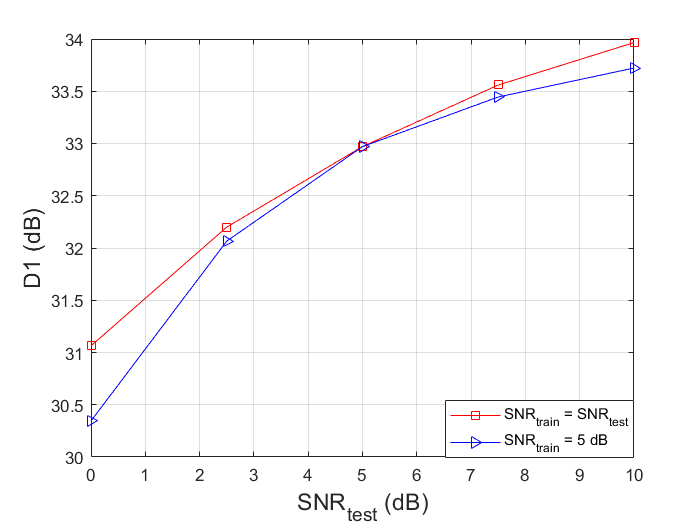

# SEPT
Source code for paper Wireless Point Cloud Transmission, https://arxiv.org/abs/2306.08730

## Motivation
There have already been considerable amount of works for semantic communications concerning images, speech and videos, while the transmission of point cloud is relatively less explored. Engineerers in the past would first compress the point cloud into bits using point cloud compression algorithm (e.g., [G-PCC & V-PCC](https://mpeg-pcc.org/index.php/publications/an-overview-of-ongoing-point-cloud-compression-standardization-activities-video-based-v-pcc-and-geometry-based-g-pcc/)) and the use channel codes to protect them. This would cause cliff and leveling effects. This work serves as one of the pioneering works introducing a deep joint source channel coding (DeepJSCC) approach to avoid the cliff effect and achieving impressive reconstruction performance.

## Install
* Pytorch3d (please closely follow the instructions detailed in [pytorch3d](https://github.com/facebookresearch/pytorch3d/blob/main/INSTALL.md)).
* h5py (for dataset) & open3d (for visualization):
 ```
  pip install h5py & open3d
  ```

* dataset: [shapenetv2](https://github.com/AnTao97/PointCloudDatasets), please closely follow the precedule described in the link. The number of points is sampled to 2048 via fps (furthest point sampling) algorithm.

## Usage
Train:

Change the hyper parameters, e.g., snr and bottleneck_size, then type 

```
python train_pctrans.py
```

Test:

We provide checkpoint for the setting snr = 10, reconstructed_points = 2048 and bottleneck_size = 300, available [here](https://drive.google.com/file/d/1Bty9ELdfqjdEdRaQ3pBaIQFjMpd1Eq5n/view?usp=sharing). Place it in the folder 'log/300_2048_snr10/checkpoints'  Change the parameters and type 
for evaluation.
```
python test_pctrans.py
```
## Results
### Qualitive results
We show in the left figure that the proposed scheme can outperform the [DPCC](https://github.com/arsx958/PCT_PCC) delivered under the achievable rate of finite block length ([finite block length channel coding](https://github.com/yp-mit/spectre)). We also show with a setting more favorable to the conventional GPCC algorithm, we can still outperform GPCC + finite block length achievable rate. The figure in the right shows SEPT avoids cliff effect.
<center class="half">

</center>

### Visulization
Left: original image; middle: snr = 5 dB; Right: snr = 0 dB.
<figure>
    
    
    
</figure>

### Limitations
The proposed SEPT is more beneficial for handling small point clouds (e.g., in the shapenetv2 with 2k points), it tends to be less effective when handling that in [depoco](https://github.com/PRBonn/deep-point-map-compression) for dense point cloud map with at least 30k points. It's definitely a future direction. 

## Citation
If you find the code helpful in your research or work, please consider cite:
```
@misc{sept,
      title={Wireless Point Cloud Transmission}, 
      author={Chenghong Bian and Yulin Shao and Deniz Gunduz},
      year={2023},
      eprint={2306.08730},
      archivePrefix={arXiv},
      primaryClass={eess.SP}
}
```

## Acknowledgements
We sincerely thanks the authors of [DPCC](https://github.com/arsx958/PCT_PCC) for insightful discussion. We also recommend the readers to other related repos for more info [point transformer](https://github.com/qq456cvb/Point-Transformers), [depoco](https://github.com/PRBonn/deep-point-map-compression), [finite block length channel coding](https://github.com/yp-mit/spectre).
